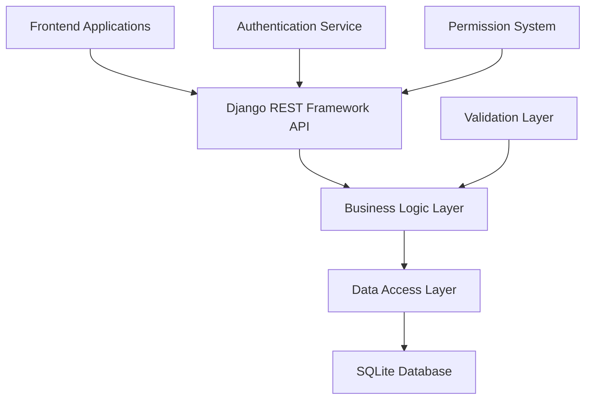
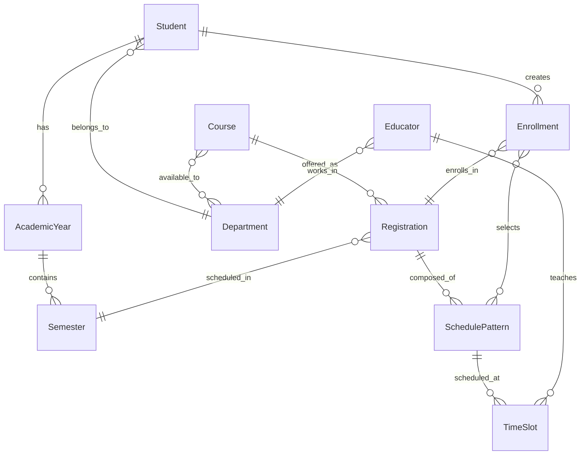

# University Student Information System (SIS) API

[](https://djangoproject.com/)
[](https://www.django-rest-framework.org/)
[](https://python.org/)
[](https://sqlite.org/)

## 🎯 Project Overview

**BetterEEH** is a comprehensive, API-first Student Information System designed to modernize university academic management. Built with Django REST Framework, it provides a robust foundation for student registration, course management, grading, and academic record tracking.

### 🏗️ System Architecture



### 🎯 Core Features

- **📚 Academic Management**: Course offerings, prerequisites, and scheduling
- **👥 Student Lifecycle**: Registration, enrollment, and academic progression
- **🎓 Grading System**: Comprehensive grade tracking and GPA calculation
- **📅 Schedule Management**: Flexible timetabling with conflict detection
- **🏢 Department Structure**: Multi-departmental course sharing and access control
- **🔐 Authentication & Authorization**: JWT-based security with role-based permissions

---

## 📋 Table of Contents

- [Quick Start](#-quick-start)
- [System Architecture](#️-system-architecture-1)
- [Database Schema](#-database-schema)
- [API Documentation](#-api-documentation)
- [Development Guide](#-development-guide)
- [Testing Strategy](#-testing-strategy)
- [Deployment](#-deployment)
- [Contributing](#-contributing)

---

## 🚀 Quick Start

### Prerequisites

- Python 3.11+
- pip or pipenv
- Git

### Installation

```bash
# Clone the repository
git clone https://github.com/your-org/betterEEH.git
cd betterEEH/API

# Create virtual environment
pipenv install  # or pip install -r requirements.txt

# Activate environment
pipenv shell

# Apply database migrations
python manage.py migrate

# Create superuser
python manage.py createsuperuser

# Start development server
python manage.py runserver
```

### Environment Configuration

```bash
# .env file (create in project root)
DEBUG=True
SECRET_KEY=your-secret-key-here
DATABASE_URL=sqlite:///db.sqlite3
ALLOWED_HOSTS=localhost,127.0.0.1
```

---

## 🏗️ System Architecture

### Technology Stack

| Layer | Technology | Purpose |
|-------|------------|---------|
| **API Framework** | Django REST Framework 3.15+ | RESTful API development |
| **Backend** | Django 5.2+ | Web framework and ORM |
| **Database** | SQLite (dev) / PostgreSQL (prod) | Data persistence |
| **Authentication** | JWT (djangorestframework-simplejwt) | Stateless authentication |
| **Validation** | Django Validators + Custom | Data integrity |
| **Testing** | Django Test Framework + pytest | Quality assurance |

### Design Principles

1. **API-First Design**: All functionality exposed through well-documented APIs
2. **Separation of Concerns**: Clear distinction between models, views, and business logic
3. **Scalability**: Designed to handle growing student populations and course offerings
4. **Flexibility**: Configurable to adapt to different university structures
5. **Security**: Built-in authentication, authorization, and data validation

---

## 🗄️ Database Schema

### Entity Relationship Diagram



### Core Models Documentation

#### 1. Student Model

**Purpose**: Central entity representing university students with comprehensive academic and personal information.

```python
class Student(models.Model):
    """
    Represents a university student with academic and personal information.
    
    Primary Key: studentId (5-character unique identifier)
    
    Business Rules:
    - Student ID must be exactly 5 characters
    - National ID must be exactly 14 characters
    - Level ranges from 0-4 (0=Preparatory, 1-4=Academic levels)
    - Status transitions: active -> inactive/graduated
    """
    
    # Identity Fields
    nameAr = models.CharField(max_length=200, blank=False)
    nameEn = models.CharField(max_length=200, blank=False) 
    studentId = models.CharField(max_length=5, unique=True, primary_key=True)
    nationalId = models.CharField(max_length=14, unique=True, validators=[...])
    
    # Academic Fields
    level = models.SmallIntegerField(default=0, validators=[MaxValueValidator(4)])
    earnedHours = models.SmallIntegerField(default=0)
    department = models.ForeignKey('Department', on_delete=models.CASCADE)
    
    # Status & Contact
    status = models.CharField(choices=STATUS_CHOICES, max_length=10, default='active')
    email = models.EmailField(max_length=254, blank=True, null=True)
    phone = models.CharField(max_length=15, blank=True, null=True)
    dateOfBirth = models.DateField()
    address = models.CharField(max_length=255)
```

**Key Relationships**:
- `department` → Many students belong to one department
- `academic_years` → One student has multiple academic years
- `enrollments` → One student has multiple course enrollments

**Constraints**:
- `studentId`: Unique, exactly 5 characters
- `nationalId`: Unique, exactly 14 characters
- `level`: 0-4 range validation

---

#### 2. Course Model

**Purpose**: Represents academic courses with prerequisites, departmental access, and metadata.

```python
class Course(models.Model):
    """
    Academic course definition with prerequisites and departmental associations.
    
    Primary Key: courseCode (6-character unique identifier)
    
    Business Rules:
    - Course codes must be unique across the system
    - Prerequisites form a directed acyclic graph (no circular dependencies)
    - Courses can be shared across multiple departments
    - Level indicates academic complexity (0-4)
    """
    
    # Core Information
    courseName = models.CharField(max_length=200)
    courseCode = models.CharField(max_length=6, unique=True, primary_key=True)
    credits = models.SmallIntegerField(default=3)
    description = models.TextField(blank=True, null=True)
    
    # Academic Structure
    level = models.SmallIntegerField(default=0)
    type = models.CharField(choices=TYPE_CHOICES, max_length=15, default='core')
    
    # Relationships
    prerequisites = models.ManyToManyField('self', blank=True, symmetrical=False)
    departments = models.ManyToManyField('Department', related_name='courses')
```

**Key Relationships**:
- `prerequisites` → Self-referential many-to-many for course dependencies
- `departments` → Many-to-many allowing cross-departmental courses
- `registrations` → One course can have multiple semester offerings

**Business Logic**:
- Prerequisites validation prevents circular dependencies
- Department association controls student access
- Course type affects graduation requirements

---

#### 3. Registration Model

**Purpose**: Represents a specific offering of a course in a semester with enrollment groups.

```python
class Registration(models.Model):
    """
    A specific offering of a course in a semester.
    
    Unique Constraint: (course, semester, level, group_number)
    
    Business Rules:
    - One course can have multiple registrations per semester (different groups)
    - Level and group_number organize students for scheduling
    - Capacity limits total enrollment
    - Active/inactive status controls availability
    """
    
    # Core References
    course = models.ForeignKey(Course, on_delete=models.CASCADE)
    semester = models.ForeignKey(Semester, on_delete=models.CASCADE)
    
    # Organization
    level = models.SmallIntegerField(validators=[MinValueValidator(0), MaxValueValidator(4)])
    group_number = models.PositiveIntegerField()
    
    # Enrollment Management
    capacity = models.PositiveIntegerField(default=60)
    is_active = models.BooleanField(default=True)
    
    class Meta:
        unique_together = [['course', 'semester', 'level', 'group_number']]
```

**Key Features**:
- **Flexible Grouping**: Students can register across groups if slots available
- **Capacity Management**: Prevents over-enrollment
- **Level Organization**: Supports academic progression tracking

---

#### 4. SchedulePattern Model

**Purpose**: Defines selectable scheduling components within a registration (lectures, labs, tutorials).

```python
class SchedulePattern(models.Model):
    """
    A selectable component of a course registration.
    
    Examples: "Main Lecture", "Tutorial Group 1", "Lab Section A"
    
    Business Rules:
    - Students must select patterns to complete enrollment
    - Each pattern has independent capacity limits
    - Pattern types determine academic requirements
    """
    
    registration = models.ForeignKey(Registration, on_delete=models.CASCADE)
    pattern_name = models.CharField(max_length=100)
    pattern_type = models.CharField(choices=PATTERN_CHOICES, max_length=3)
    capacity = models.PositiveIntegerField(default=30)
    
    class Meta:
        unique_together = [['registration', 'pattern_name']]
```

**Pattern Types**:
- `LEC` (Lecture): Usually mandatory, larger capacity
- `LAB` (Laboratory): Hands-on sessions, smaller capacity  
- `TUT` (Tutorial): Discussion groups, smallest capacity

---

#### 5. TimeSlot Model

**Purpose**: Specific time periods for schedule patterns with educator and location assignment.

```python
class TimeSlot(models.Model):
    """
    A specific time period for a schedule pattern.
    
    Business Rules:
    - Patterns can have multiple time slots (e.g., lecture on Sun + Tue)
    - Time periods are numbered 1-12 representing university schedule
    - Conflict detection prevents overlapping enrollments
    - Each slot can have different educators
    """
    
    pattern = models.ForeignKey(SchedulePattern, on_delete=models.CASCADE)
    educator = models.ForeignKey(Educator, on_delete=models.CASCADE, blank=True)
    
    # Timing
    day = models.PositiveSmallIntegerField(choices=DAY_CHOICES)  # 0=Sat, 5=Thu
    start_period = models.SmallIntegerField(validators=[MinValueValidator(1), MaxValueValidator(12)])
    end_period = models.SmallIntegerField(validators=[MinValueValidator(1), MaxValueValidator(12)])
    
    # Location
    location = models.CharField(max_length=100, blank=True, null=True)
    
    class Meta:
        ordering = ['day', 'start_period']
        unique_together = [['pattern', 'day', 'start_period']]
    
    def clean(self):
        """Validates that end_period > start_period"""
        if self.start_period and self.end_period and self.end_period < self.start_period:
            raise ValidationError("End period cannot be earlier than start period.")
```

**Time System**:
- **Days**: Saturday (0) through Thursday (5) - Middle Eastern academic week
- **Periods**: 1-12 representing time slots throughout the day
- **Validation**: Ensures logical time ordering and prevents conflicts

---

#### 6. Enrollment Model

**Purpose**: Links students to registrations with their selected schedule patterns and academic records.

```python
class Enrollment(models.Model):
    """
    Student enrollment in a specific course registration.
    
    Business Rules:
    - One student can only enroll in one registration per course per semester
    - Students must select schedule patterns to complete enrollment
    - Grade tracking throughout semester progression
    - Academic record maintenance
    """
    
    # Core Relationships
    student = models.ForeignKey(Student, on_delete=models.CASCADE)
    registration = models.ForeignKey(Registration, on_delete=models.CASCADE)
    semester = models.ForeignKey(Semester, on_delete=models.CASCADE)
    
    # Schedule Selection
    selected_patterns = models.ManyToManyField(SchedulePattern, related_name='enrollments')
    
    # Academic Records
    letterGrade = models.CharField(max_length=2, blank=True, null=True)
    numericGrade = models.DecimalField(max_digits=3, decimal_places=2, default=0.0)
    
    # Assessment Breakdown
    courseworkMax = models.SmallIntegerField(default=50)
    coursework = models.SmallIntegerField(default=0)
    examMax = models.SmallIntegerField(default=50)  
    exam = models.SmallIntegerField(default=0)
    total = models.SmallIntegerField(default=0)
    
    class Meta:
        unique_together = [['student', 'registration']]
    
    def get_all_time_slots(self):
        """Returns all time slots for this enrollment's selected patterns."""
        return TimeSlot.objects.filter(pattern__in=self.selected_patterns.all())
```

**Academic Features**:
- **Flexible Grading**: Supports various assessment structures
- **Schedule Assembly**: Combines selected patterns into student timetable
- **Progress Tracking**: Links to semester and academic year progression

---

### Supporting Models

#### Department Model
```python
class Department(models.Model):
    """Academic department with unique code and description."""
    name = models.CharField(max_length=100, unique=True)
    desc = models.TextField(blank=True, null=True)
    code = models.CharField(max_length=3, unique=True, primary_key=True)
```

#### Educator Model  
```python
class Educator(models.Model):
    """University faculty and staff with departmental association."""
    nameAr = models.CharField(max_length=200)
    nameEn = models.CharField(max_length=200)
    educatorId = models.CharField(max_length=5, unique=True, primary_key=True)
    type = models.CharField(choices=TYPE_CHOICES, max_length=30, default='Lecturer')
    department = models.ForeignKey(Department, on_delete=models.CASCADE)
```

#### AcademicYear & Semester Models
```python
class AcademicYear(models.Model):
    """Student's academic year progression."""
    student = models.ForeignKey(Student, on_delete=models.CASCADE)
    yearName = models.CharField(max_length=10)

class Semester(models.Model):
    """Semester within an academic year with GPA tracking."""
    academicYear = models.ForeignKey(AcademicYear, on_delete=models.CASCADE)
    semesterName = models.CharField(choices=SEMESTER_CHOICES, max_length=10)
    gpa = models.DecimalField(max_digits=3, decimal_places=2, default=0.0)
    cgpa = models.DecimalField(max_digits=3, decimal_places=2, default=0.0)
```

---

## API Endpoints Documentation

### 🚧 Planned Endpoints

#### Student Management
- `GET /api/students/` - List all students
- `POST /api/students/` - Create new student
- `GET /api/students/{id}/` - Get student details
- `PUT /api/students/{id}/` - Update student
- `DELETE /api/students/{id}/` - Delete student

#### Subject Management
- `GET /api/subjects/` - List all subjects
- `POST /api/subjects/` - Create new subject
- `GET /api/subjects/{id}/` - Get subject details
- `PUT /api/subjects/{id}/` - Update subject
- `DELETE /api/subjects/{id}/` - Delete subject

#### Enrollment Management
- `GET /api/enrollments/` - List enrollments
- `POST /api/enrollments/` - Enroll student in subject
- `GET /api/students/{id}/enrollments/` - Get student's enrollments
- `PUT /api/enrollments/{id}/grade/` - Update grade

#### Timetable Management
- `GET /api/timetables/` - List all timetables
- `GET /api/students/{id}/timetable/` - Get student's timetable
- `GET /api/subjects/{id}/schedule/` - Get subject schedule

---

## Development Progress

### ✅ Completed
- [x] Django project setup
- [x] Django REST Framework installation
- [x] Basic project structure
- [x] Settings configuration

### 🚧 In Progress
- [ ] Design and implement core models
- [ ] Set up Django admin interface
- [ ] Create API serializers
- [ ] Implement API views and endpoints
- [ ] Add authentication and permissions

### 📋 To Do
- [ ] Data validation and error handling
- [ ] Unit tests for models and APIs
- [ ] API documentation (Swagger/OpenAPI)
- [ ] Frontend integration planning
- [ ] Deployment configuration

---

## Development Notes

### Quick Commands
```bash
# Run development server
python manage.py runserver

# Create migrations
python manage.py makemigrations

# Apply migrations  
python manage.py migrate

# Create superuser
python manage.py createsuperuser

# Run tests
python manage.py test
```

### Learning Resources
- [Django Documentation](https://docs.djangoproject.com/)
- [Django REST Framework](https://www.django-rest-framework.org/)
- [Django Models Reference](https://docs.djangoproject.com/en/5.2/topics/db/models/)

---

## Change Log

| Date | Changes | Notes |
|------|---------|-------|
| 2025-07-16 | Initial project setup | Created Django project with DRF |
| 2025-07-17 | Updated Models Documentation | Synced documentation with current `models.py`. |
| 2025-07-17 | Refactored Models & Added Timetable | Updated models and added a new Timetable model for scheduling. |
| | | Add new entries as you progress |

---

## Notes & Ideas

### Features to Consider
- Grade point average (GPA) calculation
- Academic transcript generation
- Course prerequisites validation
- Attendance tracking
- Fee management
- Academic calendar integration

### Technical Considerations
- Add pagination for large datasets
- Implement proper error handling
- Add logging for debugging
- Consider caching for performance
- Plan for database optimization

---

*Last Updated: July 17, 2025*
